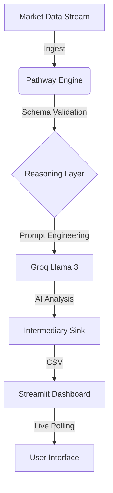

# 🌱 Green Bharat: Live AI Market Intelligence

[](https://www.python.org/downloads/release/python-3120/)
[](https://pathway.com/)
[](https://streamlit.io/)
[](https://groq.com/)
[](https://opensource.org/licenses/MIT)

A real-time sustainability and ESG analysis platform that leverages **Pathway** for continuous data streaming and **Groq's Llama 3** models for live reasoning.

## 🚀 Key Features

*   **Continuous Ingestion Layer**: Simulated live data streams for companies and their ESG scores using Pathway's reactive engine.
*   **Real-Time AI Reasoning**: Live analysis streams using `LiteLLMChat` connected to Groq for sub-second insights.
*   **Premium Interactive UI**: A sleek, auto-refreshing dashboard built with Streamlit featuring real-time metrics and AI-driven insights.
*   **Modular Architecture**: Clean separation of concerns between backend processing, frontend UI, and centralized configuration.

## 📁 Repository Structure

```text
.
├── data/                       # Local data storage (intermediary storage)
├── src/                        # Source code for the application
│   ├── backend/                # Pathway streaming data pipeline
│   │   ├── __init__.py
│   │   └── pipeline.py         # Main streaming logic
│   ├── frontend/               # Streamlit application dashboard
│   │   ├── __init__.py
│   │   └── dashboard.py        # UI presentation layer
│   └── config.py               # Centralized configuration
├── tests/                      # Unit tests for backend and config
├── Dockerfile                  # Containerization setup
├── Makefile                    # Task orchestration (macOS/Linux)
├── run.bat                     # Quick-start script (Windows)
├── requirements.txt            # Python dependencies
├── LICENSE                     # MIT License
└── README.md                   # This file
```

## 📚 Documentation

Detailed documentation for each component can be found in the `docs/` directory:

- [**Backend (Pathway Pipeline)**](docs/backend.md)
- [**Frontend (Streamlit UI)**](docs/frontend.md)
- [**Configuration System**](docs/config.md)
- [**Testing Guide**](docs/testing.md)
- [**Deployment Guide**](docs/deployment.md)

## 🏗️ Architecture



## 🛠️ Getting Started

### Prerequisites
- Python 3.10+
- [Groq API Key](https://console.groq.com/) for Llama 3 LLM access.

### Installation

1.  **Clone the repository**:
    ```bash
    git clone https://github.com/yourusername/green-bharat-ai.git
    cd green-bharat-ai
    ```

2.  **Environment Setup**:
    ```bash
    # Create virtual environment
    python -m venv venv
    
    # Activate and install (Windows)
    venv\Scripts\activate
    pip install -r requirements.txt
    ```

3.  **Configuration**:
    Create a `.env` file in the root directory:
    ```env
    GROQ_API_KEY=your_groq_api_key_here
    ```

### Running Locally

*   **Windows**: Run `run.bat` or `python -m src.backend.pipeline` and `streamlit run src/frontend/dashboard.py` in separate terminals.
*   **Linux/macOS**: Use `make run-all`.

## 🧪 Testing

Run unit tests to verify the pipeline and configuration:
```bash
pytest tests/
```

## 📝 License

Distributed under the MIT License. See `LICENSE` for more information.
